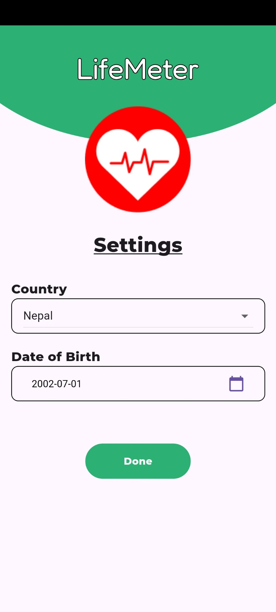
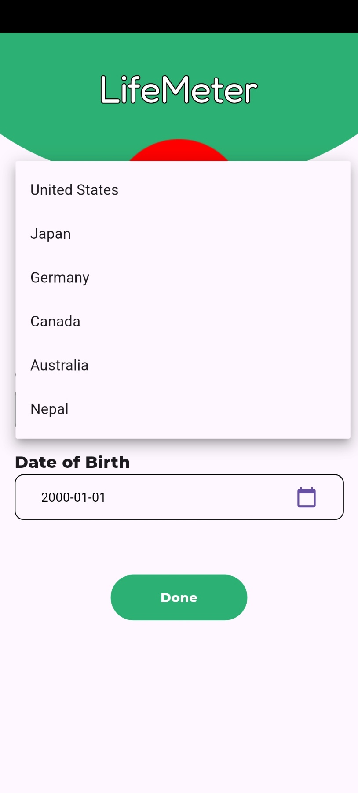
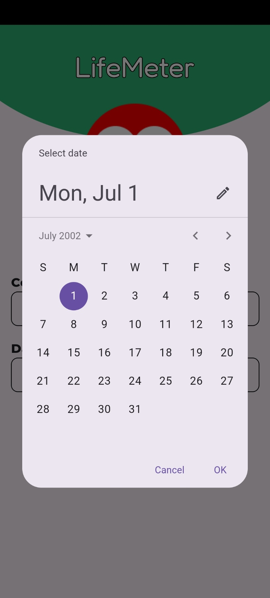
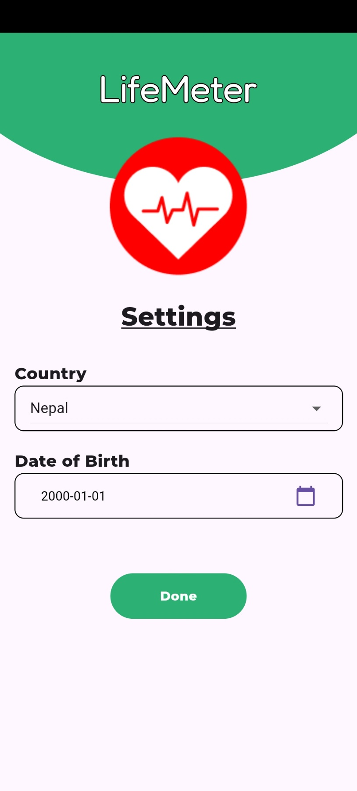
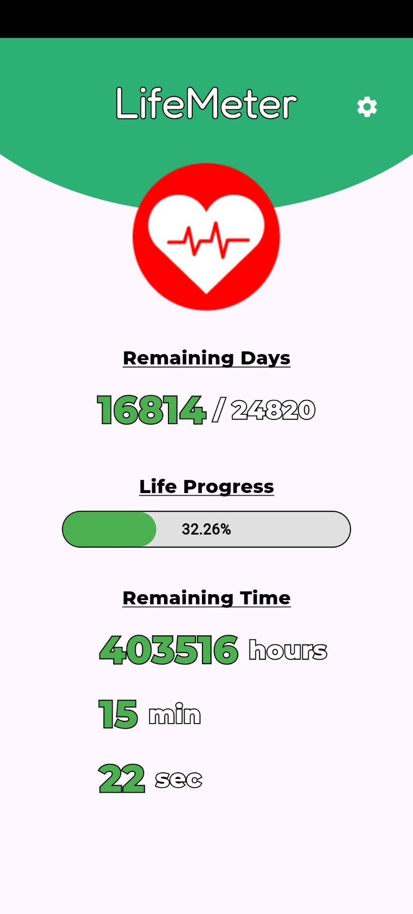

# LifeMeter

LifeMeter is a simple yet powerful app designed to help you understand and visualize your life expectancy. By providing your date of birth and selecting your country, LifeMeter calculates and presents your remaining life span in an intuitive and engaging way.

## Features

- **Remaining Days:** LifeMeter calculates the number of days you have left based on the average life expectancy for your country.
  
- **Life Progress Bar:** Visualize your life journey with an interactive progress bar comparing your current age to the average life expectancy.

- **Remaining Time:** Get a detailed breakdown of your remaining time in months, weeks, and hours.

## Screenshots

  
  
  
  
  

## Installation

To use LifeMeter, simply download the latest version from the [Releases](https://github.com/gaurovgiri/lifemeter/releases) page and install it on your Android device.

## Usage

1. Launch the LifeMeter app.
2. Select your country.
3. Enter your date of birth.
4. Explore your remaining life span and gain insights into your life expectancy.

## Contributing

Contributions are welcome! If you have any ideas for new features or improvements, feel free to open an issue or submit a pull request.

## License

This project is licensed under the [MIT License](LICENSE).

## Contact

For support and feedback, please contact Gaurav Giri at gaurovgiri@gmail.com.
